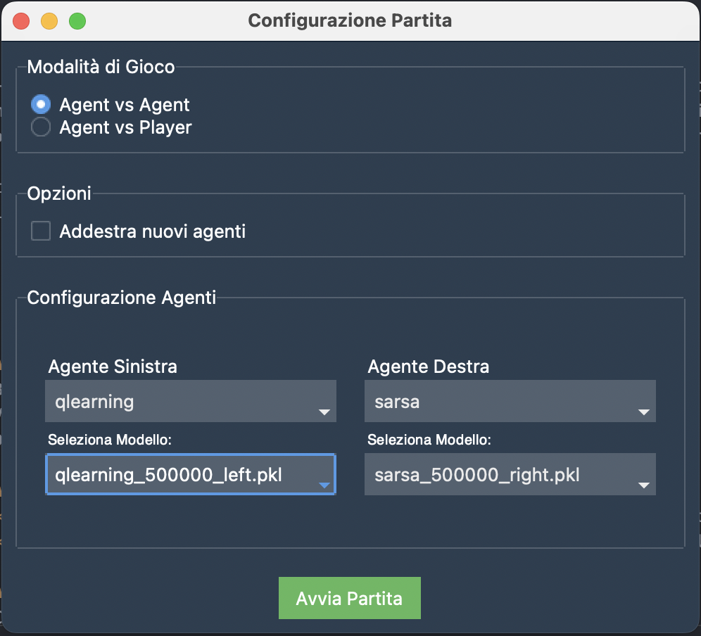

# Ping-Pong AI: Reinforcement Learning for Multiplayer Pong

Interfaccia                |  Gameplay
:-------------------------:|:-------------------------:
  |  

## 📖 Overview

Ping-Pong AI è un progetto di apprendimento per rinforzo (RL) sviluppato per simulare e ottimizzare il comportamento di due agenti in un ambiente multiplayer Pong. Il progetto include due algoritmi principali, **Q-Learning** e **SARSA**, e utilizza una pipeline personalizzata basata su **OpenAI Gym** e **Pygame** per la visualizzazione.

Questo repository fornisce il codice, i risultati degli esperimenti e una descrizione delle metodologie utilizzate per creare agenti intelligenti in grado di competere in un ambiente di gioco dinamico.

---

## ✨ Features

- **Ambiente Personalizzato**:
  - Basato su **OpenAI Gym** per scalabilità e modularità.
  - Visualizzazione con **Pygame**.
  - Definizione di stati e azioni specifiche per il gioco Pong.

- **Algoritmi Implementati**:
  - **Q-Learning** (off-policy): Massimizza le ricompense esplorando strategie alternative.
  - **SARSA** (on-policy): Apprendimento basato sulle azioni effettive dell'agente.

- **Analisi dei Risultati**:
  - Confronto tra Q-Learning e SARSA.
  - Grafici e statistiche per valutare la convergenza e l'efficienza dei modelli.

---

## 📂 Project Structure

```
Ping-Pong-AI/
│
├── agents/
│   ├── base_agent.py          # Classe base per gli agenti RL
│   ├── qlearning_agent.py     # Implementazione di Q-Learning
│   ├── sarsa_agent.py         # Implementazione di SARSA
│
├── utils/
│   ├── visualizer.py          # Rendering dell'ambiente con Pygame
│   ├── discretizer.py         # Discretizzazione degli stati continui
│   ├── parameters.py          # Parametri RL e ambientali
│   ├── plotter.py             # File per il salvataggio dei plot generati
├── environment/
│   ├── pong_environment.py            # Ambiente Multiplayer Pong
│
├── results/
│   ├── qlearning_vs_sarsa_training_rewards_500000.png  # Grafico finale
│   ├── ...                                             # Altri risultati
│
├── main.py                   # Script principale per lanciare il programma
└── README.md                 # Documentazione del progetto
```

---

## 🚀 Getting Started

### Prerequisites

Assicurati di avere installato:
- Python 3.8 o superiore
- Librerie necessarie: `gym`, `pygame`, `numpy`, `matplotlib`

### Installazione

1. Clona il repository:
   ```bash
   git clone https://github.com/<tuo_username>/pingpong-ai.git
   cd pingpong-ai
   ```

2. Installa i requisiti:
   ```bash
   pip install -r requirements.txt
   ```

---

## 🧠 Training the Agents

Esegui lo script principale per addestrare gli agenti con Q-Learning o SARSA:
```bash
python main.py
```

Il comando lancia un'interfaccia grafica che consente all'utente di personalizzare la fase di training oppure eseugire direttamente un test con dei modelli preaddestrati.

---

## 📊 Results

### Q-Learning vs SARSA
I seguenti grafici mostrano il confronto tra Q-Learning e SARSA durante l'addestramento:


- **Q-Learning**:
  - Convergenza più rapida.
  - Ricompense cumulative più elevate.
- **SARSA**:
  - Apprendimento più conservativo, ma stabile.

---

## 🛠 Future Work

- Estendere il progetto per includere algoritmi avanzati come **Deep Q-Learning (DQN)**.
- Introdurre varianti dell'ambiente, ad esempio cambiamenti nella velocità della palla o nelle dimensioni delle racchette.
- Migliorare la discretizzazione degli stati per aumentare la precisione del modello.

---

## 📧 Contatti

Hai domande? Contattami:
- Email: **s.sirica2000@gmail.com**
- LinkedIn: **[Salvatore Sirica](https://www.linkedin.com/in/salvatore-sirica-823325208/)**